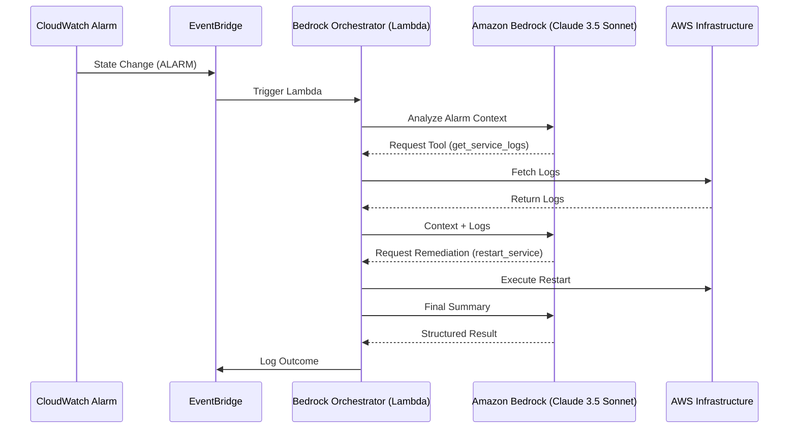

# AWS Bedrock Ops Agent
**Autonomous Production Reliability Orchestrator for Self-Healing Infrastructure**

This repository contains a production-grade AI agent designed to automate cloud infrastructure remediation. Unlike standard "chatbots," this agent is event-driven and capable of autonomous tool-calling to triage and fix operational incidents.

## 🏗️ Architecture



## 🚀 Key Features
*   **Event-Driven Workflow**: Triggered automatically by CloudWatch Alarms via EventBridge.
*   **Autonomous Remediation**: Uses Anthropic Claude 3.5 Sonnet to decide between investigation (`get_service_logs`) or action (`restart_service`, `scale_up`).
*   **Production Reliability-First Design**: Implements structured JSON logging, strict IAM least-privilege boundaries, and log retention policies.
*   **Infrastructure as Code**: Fully managed via Terraform with modular variables and security hardening.

## 🛠️ Tech Stack
*   **AI Engine**: Amazon Bedrock (Anthropic Claude 3.5 Sonnet)
*   **Compute**: AWS Lambda (Python 3.12)
*   **Infrastructure**: Terraform
*   **Observability**: CloudWatch Logs & EventBridge

## 📋 Deployment

1.  **Configure Variables**: Update `variables.tf` with your preferred region and model settings.
2.  **Initialize & Apply**:
    ```bash
    terraform init
    terraform apply
    ```

## 🧪 Simulation
To test the agent's response to an incident without triggering a real alarm, use the provided simulation script:
```bash
./scripts/simulate-alarm.sh
```

## 🔐 Security & Reliability
*   **IAM Scoping**: The execution role is strictly limited to invoking the specific Claude 3 model and targeted remediation actions.
*   **Error Handling**: Includes a Dead Letter Queue (DLQ) for failed orchestrations and comprehensive `try-except` blocks with structured logging.
*   **Observability**: Managed CloudWatch Log Groups with automatic 14-day retention.
